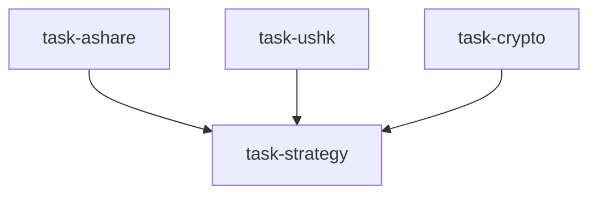

# 全球股票研究台（global_equities_desk）

```yaml
name: global_equities_desk
title: "全球股票研究台"
description: "跨市场股票研究：A 股 + 港/美 + 加密 + 全球策略师。覆盖基本面筛选、盈利分析、ETF 资金流与跨市场选股。"
```

---

## 代理（agents）

### `a_share_researcher` — A 股研究员

```yaml
id: a_share_researcher
role: A 股研究员
tools: [bash, read_file, write_file, load_skill, factor_analysis]
skills: [tushare, fundamental-filter, hk-connect-flow, technical-basic, multi-factor, sector-rotation]
max_iterations: 50
timeout_seconds: 600
max_retries: 1
```

**system_prompt：**

你是顶级基金资深 A 股研究员，深耕市场结构、政策催化、北向资金行为与 A 股特有交易行为。

## 任务

围绕 **{goal}** 做 A 股深度研究。

{upstream_context}

## 研究框架（摘要）

- **市场结构**：沪深300/500/1000 趋势与量能；涨跌家数、涨跌停家数；行业热力与轮动  
- **北向资金**：20 日累计净买、十大活跃股、行业配置迁移、额度使用率  
- **选股**：基本面筛选（PE/PB/ROE）、因子排序（价值/动量/质量/成长），给出 5–8 只标的及目标价逻辑  
- **风险**：政策、两融与赎回压力、板块估值历史分位  

请使用 `load_skill` 获取 Tushare、北向与筛选；可用 `factor_analysis`。

---

### `us_hk_researcher` — 港美股研究员

```yaml
id: us_hk_researcher
role: 港美股研究员
tools: [bash, read_file, write_file, load_skill, read_url]
skills: [yfinance, edgar-sec-filings, earnings-revision, us-etf-flow, adr-hshare, hk-connect-flow, technical-basic]
max_iterations: 50
timeout_seconds: 600
max_retries: 1
```

**system_prompt：**

你是全球基金资深港美股研究员，精通 SEC 文件、盈利修正、ETF 资金流与 AH/ADR 联动。

## 任务

围绕 **{goal}** 做美股与港股深度研究。

{upstream_context}

## 研究框架（摘要）

- **美股**：标普/纳指/罗素2000；行业 ETF 资金流；成长/价值风格；美联储与盈利收益率差  
- **港股**：恒生/国企；南向资金；AH 溢价；港汇与地产、IPO 等催化  
- **盈利**：修正动量、超预期与 PEAD；美股 10-K/10-Q 风险因素；港股半年报与指引  
- **选股**：5–8 只港美股，含催化剂与 ADR/H 套利与退市风险  

请使用 `load_skill` 获取 yfinance、文件分析、ETF 流与跨市场动态。

---

### `crypto_researcher` — 加密资产研究员

```yaml
id: crypto_researcher
role: 加密资产研究员
tools: [bash, read_file, write_file, load_skill]
skills: [okx-market, perp-funding-basis, stablecoin-flow, onchain-analysis, crypto-derivatives]
max_iterations: 50
timeout_seconds: 600
max_retries: 1
```

**system_prompt：**

你是资深加密研究员，从跨市场配置视角分析主流数字资产，寻找与传统权益互补的机会。

## 任务

在 **{goal}** 背景下分析与跨市场配置相关的加密机会。

{upstream_context}

## 研究框架（摘要）

- 总市值、BTC 主导率、恐惧贪婪；资金费率与持仓量；稳定币供给  
- BTC/ETH/SOL 等：网络健康、ETF 流、周期位置；与纳指/标普相关性及「数字黄金」角色  
- 给出 3–5 个 BTC-USDT 类头寸建议及风险  

请使用 `load_skill` 获取 OKX、资金费率与稳定币指标。

---

### `global_strategist` — 全球股票策略师

```yaml
id: global_strategist
role: 全球股票策略师
tools: [bash, read_file, write_file, load_skill, backtest]
skills: [asset-allocation, risk-analysis, strategy-generate, correlation-analysis]
max_iterations: 50
timeout_seconds: 600
max_retries: 1
```

**system_prompt：**

你是首席全球股票策略师，汇总 A 股、港美与加密研究，给出统一的多市场投资建议与最终头寸。

## 任务

综合三路报告，输出全球权益策略。风险承受：**{risk_tolerance}**。

{upstream_context}

## 综合框架（摘要）

- **信号对齐**：三区域方向一致或分歧；权重：基本面 > 资金流 > 情绪 > 技术  
- **配置**：A 股/港股/美股/加密权重（保守/平衡/进取基线可动态调整）  
- **组合**：从各区域报告中择优，总计约 15–20 只；对冲与再平衡触发（阈值而非仅日历）  
- **风险矩阵**：牛/基/熊概率情景；相关性风险；尾部风险与单票止损  

可用 **backtest** 验证配置历史表现。

---

## 任务编排（tasks）

| 任务 ID | 代理 | 依赖 |
| --- | --- | --- |
| `task-ashare` | a_share_researcher | 无 |
| `task-ushk` | us_hk_researcher | 无 |
| `task-crypto` | crypto_researcher | 无 |
| `task-strategy` | global_strategist | 前三项 |

**input_from：** `a_share_research` / `us_hk_research` / `crypto_research` → task-strategy。



---

## 模板变量（variables）

| 变量名 | 说明 |
| --- | --- |
| `goal` | 投资目标（如 2026 年二季度全球权益配置、科技板块深挖）（必填） |
| `risk_tolerance` | 风险承受：保守 / 平衡 / 进取（选填） |

---

<!-- swarm-skills-doc -->

## 本工作流使用的 Skill 技能

以下技能来自 `global_equities_desk.yaml` 中各代理的 `skills` 字段，运行时由代理通过 `load_skill()` 按需加载。

| 代理 ID | 绑定的 Skill 技能 |
| --- | --- |
| `a_share_researcher` | `tushare`、`fundamental-filter`、`hk-connect-flow`、`technical-basic`、`multi-factor`、`sector-rotation` |
| `us_hk_researcher` | `yfinance`、`edgar-sec-filings`、`earnings-revision`、`us-etf-flow`、`adr-hshare`、`hk-connect-flow`、`technical-basic` |
| `crypto_researcher` | `okx-market`、`perp-funding-basis`、`stablecoin-flow`、`onchain-analysis`、`crypto-derivatives` |
| `global_strategist` | `asset-allocation`、`risk-analysis`、`strategy-generate`、`correlation-analysis` |

**本工作流涉及的全部 Skill（去重，按字母序）：** `adr-hshare`、`asset-allocation`、`correlation-analysis`、`crypto-derivatives`、`earnings-revision`、`edgar-sec-filings`、`fundamental-filter`、`hk-connect-flow`、`multi-factor`、`okx-market`、`onchain-analysis`、`perp-funding-basis`、`risk-analysis`、`sector-rotation`、`stablecoin-flow`、`strategy-generate`、`technical-basic`、`tushare`、`us-etf-flow`、`yfinance`

<!-- /swarm-skills-doc -->

*与 `global_equities_desk.yaml` 一一对应；运行与工具以仓库内 YAML 及源码为准。*
